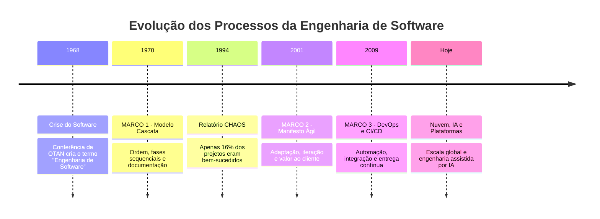
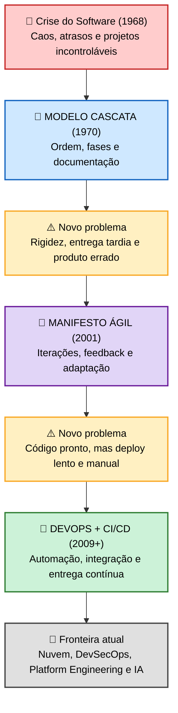

# 📚 Linha do Tempo Interativa — Marcos Históricos da Engenharia de Software


---

## 👩‍🎓 Identificação Acadêmica

| Campo | Descrição |
| :--- | :--- |
| **Unidade Curricular** | `[TADS25.109/3N]` Engenharia de Software — 2026.2 |
| **Professora** | Sonia Gomes de Oliveira |
| **Instituição** | Faculdade Senac de Pernambuco — Recife/PE |
| **Curso** | Análise e Desenvolvimento de Sistemas |
| **Turma** | 2025.32.109 — Noite |
| **Aluna** | Thayná Batista da Silva |

---

## 🎯 Objetivo da Atividade

Construir uma **linha do tempo cronológica e interativa** da Engenharia de Software, apresentando **3 marcos históricos** e relacionando cada um deles aos **desafios reais enfrentados em projetos de desenvolvimento de sistemas** — tanto os problemas que cada marco *resolveu* quanto os novos problemas que cada um *trouxe*.

Cada marco segue rigorosamente a estrutura solicitada:
`1. Ano ou período` → `2. Marco histórico` → `3. Contexto` → `4. Desafio real`

---

## 🧨 Ponto de Partida: A "Crise do Software" (1968)

> [!WARNING]
> ### Por que a Engenharia de Software precisou existir?
> Em **outubro de 1968**, na Conferência da **OTAN (NATO)** em *Garmisch-Partenkirchen*, Alemanha, foi cunhado oficialmente o termo **"Engenharia de Software"**. O motivo era alarmante: o hardware evoluía em velocidade exponencial, mas o software **não conseguia acompanhar**.
>
> Esse cenário ficou conhecido como **Crise do Software**, caracterizado por:
> * 📉 Projetos entregues com **anos de atraso** e estourando o orçamento em até 200%;
> * 🐞 Sistemas cheios de defeitos e praticamente **impossíveis de manter**;
> * 🧩 Total ausência de método: programava-se no estilo *"code and fix"* (codifica e remenda);
> * 👥 A ilusão de que "colocar mais programadores" resolveria atrasos — mito derrubado por **Fred Brooks** em *The Mythical Man-Month* (1975), com a célebre frase: *"acrescentar pessoas a um projeto atrasado o torna ainda mais atrasado"*.
>
> **É como resposta a essa crise que nascem os três marcos analisados a seguir.**

---

<a id="topo"></a>
## 🗺️ Painel de Navegação Interativa

> **Como usar esta linha do tempo:**
> **1º)** Clique em um dos botões 3D abaixo → a página desliza automaticamente até o marco.
> **2º)** Clique em **"🔍 ABRIR POPUP"** → o conteúdo completo se expande com animação.
> **3º)** Clique em **"🔝 Voltar ao Menu"** → você retorna instantaneamente para cá.

<div align="center">
  <br>

  <a href="#marco1">
    <kbd> &nbsp; 🌊 &nbsp; 1970 <br> Modelo Cascata &nbsp; </kbd>
  </a>
  &nbsp;&nbsp; ───► &nbsp;&nbsp;
  <a href="#marco2">
    <kbd> &nbsp; 🔄 &nbsp; 2001 <br> Manifesto Ágil &nbsp; </kbd>
  </a>
  &nbsp;&nbsp; ───► &nbsp;&nbsp;
  <a href="#marco3">
    <kbd> &nbsp; 🚀 &nbsp; 2009+ <br> DevOps & CI/CD &nbsp; </kbd>
  </a>

  <br><br>

  <a href="#comparativo"><kbd> 📊 Tabela Comparativa </kbd></a>
  &nbsp;
  <a href="#causaefeito"><kbd> 🔗 Diagrama Causa & Efeito </kbd></a>
  &nbsp;
  <a href="#extra"><kbd> 🗓️ Linha do Tempo Completa </kbd></a>
  &nbsp;
  <a href="#glossario"><kbd> 📖 Glossário </kbd></a>

  <br><br>
  <i>👆 Todos os botões acima são clicáveis e navegáveis</i>
</div>

### 🕰️ Visão Cronológica Geral



---

# ⏳ OS TRÊS MARCOS HISTÓRICOS

<br>

<a id="marco1"></a>
## 🌊 MARCO 1 — Modelo Cascata (Waterfall)


<details>
<summary><b>🔍 CLIQUE AQUI PARA ABRIR O POPUP COMPLETO</b></summary>
<br>

> [!NOTE]
> ## 🏛️ 1️⃣ ANO OU PERÍODO
> **1970** — formalização a partir do artigo *"Managing the Development of Large Software Systems"*, apresentado por **Winston W. Royce** na conferência IEEE WESCON. O modelo dominou a indústria durante as décadas de **1970, 1980 e boa parte dos anos 1990**.
>
> ---
>
> ## 📜 2️⃣ MARCO HISTÓRICO
> A criação do **Modelo Cascata (Waterfall)**: o primeiro **processo de software estruturado, sequencial e documentado** amplamente adotado no mundo. Ele dividiu o desenvolvimento em fases rígidas, onde uma etapa só começa quando a anterior está integralmente concluída e aprovada.
>
> ```
>  ┌──────────────┐
>  │ 1. REQUISITOS│  Levantamento e documentação do que o sistema fará
>  └──────┬───────┘
>         ▼
>  ┌──────────────┐
>  │ 2. ANÁLISE   │  Modelagem, regras de negócio e viabilidade
>  └──────┬───────┘
>         ▼
>  ┌──────────────┐
>  │ 3. PROJETO   │  Arquitetura, banco de dados e design técnico
>  └──────┬───────┘
>         ▼
>  ┌──────────────┐
>  │ 4. CODIFICAÇÃO│ Implementação do código-fonte
>  └──────┬───────┘
>         ▼
>  ┌──────────────┐
>  │ 5. TESTES    │  Validação (somente no FINAL do projeto)
>  └──────┬───────┘
>         ▼
>  ┌──────────────┐
>  │ 6. MANUTENÇÃO│  Correções e evolução pós-entrega
>  └──────────────┘
> ```
>
> **🎭 Curiosidade histórica:** Royce **não defendia** o modelo puramente sequencial! No mesmo artigo ele afirmava que essa abordagem era *"arriscada e um convite ao fracasso"*, recomendando protótipos e iterações. A indústria, porém, adotou apenas o primeiro diagrama do artigo. O termo *"waterfall"* sequer aparece no texto original — foi popularizado depois, por Bell e Thayer (1976).
>
> **📌 Consolidação:** o modelo virou praticamente lei ao ser incorporado ao padrão militar norte-americano **DOD-STD-2167 (1985)**, obrigatório para fornecedores do Departamento de Defesa dos EUA.
>
> ---
>
> ## 🌎 3️⃣ CONTEXTO — Por que surgiu?
> * 💻 **Hardware caríssimo:** processamento em mainframes era cobrado por hora. Errar código significava desperdiçar dinheiro real — logo, era preciso **planejar exaustivamente antes de programar**.
> * 🏗️ **Inspiração na engenharia tradicional:** assim como não se levanta uma parede sem a planta baixa aprovada, o software deveria ter projeto completo antes da construção.
> * 📋 **Exigência contratual:** grandes contratos militares, bancários e aeroespaciais exigiam escopo fechado, prazo definido e documentação auditável.
> * 🧯 **Resposta direta à Crise do Software:** era preciso substituir o caos do *"code and fix"* por disciplina de engenharia.
>
> ---
>
> ## 🎯 4️⃣ DESAFIO REAL
>
> ### ✅ Desafios que o Cascata **RESOLVEU**
> | Problema anterior | Solução trazida pelo Cascata |
> | :--- | :--- |
> | Desenvolvimento improvisado e sem método | Fases padronizadas e repetíveis |
> | Impossibilidade de estimar prazo e custo | Cronograma e orçamento previsíveis |
> | Conhecimento concentrado na cabeça do programador | Documentação formal e rastreável |
> | Ausência de responsabilidade técnica | Papéis definidos e aprovações por etapa |
> | Sistemas críticos sem controle de qualidade | Base para normas de segurança e auditoria |
>
> ### ⚠️ Novos desafios que ele **CRIOU**
> * 🧊 **Rigidez extrema:** mudar um requisito na fase de testes podia significar refazer análise, projeto e código.
> * 💸 **Custo exponencial da correção:** um defeito descoberto em produção custa até **100x mais** para corrigir do que se encontrado na fase de requisitos (estudos de Barry Boehm).
> * ⏳ **Entrega tardia de valor:** o cliente só via o sistema funcionando **no fim do projeto**, muitas vezes anos depois.
> * 🎯 **Risco de "produto errado":** especificar tudo no início pressupõe que o cliente sabe exatamente o que quer — o que raramente acontece.
>
> ---
>
> ## 🧪 CASOS REAIS QUE EXPUSERAM OS LIMITES DO MODELO
>
> **☢️ Therac-25 (1985–1987) — Canadá/EUA**
> Máquina de radioterapia cujo software apresentava condições de corrida (*race conditions*). Seis pacientes receberam doses massivas de radiação, resultando em mortes. Investigações apontaram ausência de revisão independente de código e testes de integração — evidenciando que **documentar não é o mesmo que testar**.
>
> **🧳 Aeroporto Internacional de Denver (1994–1995) — EUA**
> O sistema automatizado de bagagens, planejado em escopo fechado, não suportou a complexidade real. O aeroporto atrasou **16 meses**, com prejuízo estimado em **cerca de US$ 560 milhões**, custando à cidade aproximadamente **US$ 1 milhão por dia** de atraso.
>
> **🚀 Ariane 5 — Voo 501 (4 de junho de 1996) — Agência Espacial Europeia**
> O foguete explodiu **cerca de 37 a 40 segundos após o lançamento**, com perda aproximada de **US$ 370 milhões**. Causa: reaproveitamento de código do Ariane 4 sem revalidação de contexto — a conversão de um número de ponto flutuante de 64 bits para inteiro de 16 bits gerou *overflow*. Um caso clássico de **documentação extensa, mas validação insuficiente**.
>
> **📊 Relatório CHAOS — Standish Group (1994)**
> Levantamento com milhares de projetos revelou o retrato da era Cascata: apenas **16,2% dos projetos foram concluídos com sucesso**, **52,7%** estouraram prazo/custo/escopo e **31,1% foram cancelados** antes da entrega.
>
> **🕵️ FBI — Virtual Case File (2001–2005) — EUA**
> Projeto de modernização de sistemas conduzido de forma tradicional. Após cerca de **US$ 170 milhões** investidos, foi **integralmente cancelado** sem entregar valor operacional. Anos depois, o projeto sucessor (*Sentinel*) só foi concluído após a adoção de práticas ágeis — o que nos leva diretamente ao próximo marco.
>
> ---
>
> ## 🏛️ LEGADO
> Apesar das críticas, o Cascata **não desapareceu**: continua sendo adequado em contextos de **requisitos estáveis, alta criticidade e forte exigência regulatória** — como sistemas embarcados aeronáuticos, dispositivos médicos, usinas e projetos com contrato de escopo fechado. Além disso, foi ele que estabeleceu os **conceitos fundamentais** que usamos até hoje: fases, requisitos, arquitetura, testes e manutenção.

</details>

<div align="right">
  <a href="#topo"><kbd> 🔝 Voltar ao Menu Principal </kbd></a>
</div>

---

<a id="marco2"></a>
## 🔄 MARCO 2 — Manifesto Ágil (e a popularização do Scrum)


<details>
<summary><b>🔍 CLIQUE AQUI PARA ABRIR O POPUP COMPLETO</b></summary>
<br>

> [!TIP]
> ## 🏛️ 1️⃣ ANO OU PERÍODO
> **11 a 13 de fevereiro de 2001** — reunião de **17 profissionais** de desenvolvimento de software no resort *The Lodge at Snowbird*, nas montanhas de **Utah (EUA)**. Entre eles: **Kent Beck, Martin Fowler, Ken Schwaber, Jeff Sutherland, Alistair Cockburn, Robert C. Martin, Ron Jeffries, Jim Highsmith** e outros.
>
> ---
>
> ## 📜 2️⃣ MARCO HISTÓRICO
> A publicação do **Manifesto para o Desenvolvimento Ágil de Software**, documento com **4 valores** e **12 princípios** que reposicionou o foco do processo: de *"seguir o plano"* para *"entregar valor e responder a mudanças"*.
>
> ### 💎 Os 4 Valores Ágeis
> | Valorizamos mais... | ...do que |
> | :--- | :--- |
> | 👥 **Indivíduos e interações** | processos e ferramentas |
> | 💻 **Software em funcionamento** | documentação abrangente |
> | 🤝 **Colaboração com o cliente** | negociação de contratos |
> | 🔄 **Responder a mudanças** | seguir um plano |
>
> > 📌 **Interpretação correta:** o Manifesto afirma explicitamente que *"embora haja valor nos itens à direita, valorizamos mais os itens à esquerda"*. **Ágil não significa "sem documentação" nem "sem planejamento"** — significa priorização inteligente.
>
> ### 🧠 Princípios mais impactantes (dos 12)
> * Entregar software funcionando **frequentemente** (semanas, não meses);
> * **Aceitar mudanças de requisitos**, mesmo tarde no desenvolvimento;
> * Pessoas de negócio e desenvolvedores trabalhando **juntas diariamente**;
> * Software funcionando é a **principal medida de progresso**;
> * **Simplicidade** e excelência técnica; equipes **auto-organizáveis**;
> * A equipe **reflete e se ajusta** em intervalos regulares (retrospectivas).
>
> ---
>
> ## 🌎 3️⃣ CONTEXTO — Por que surgiu?
> * 🌐 **A internet comercial mudou o ritmo do mercado (anos 1990–2000):** produtos precisavam ser lançados em meses, não em anos. A bolha das *dot-com* mostrou que **quem entregava primeiro dominava o mercado**.
> * 📉 **Fracasso comprovado dos métodos rígidos:** os dados do CHAOS Report e casos como o do FBI provaram que escopo fechado não funcionava em ambientes de mudança rápida.
> * 🧪 **Métodos leves já existiam antes de 2001:** o Manifesto foi a *união* de abordagens que já vinham sendo testadas:
>   * **Scrum** — inspirado no artigo *"The New New Product Development Game"* (Takeuchi & Nonaka, Harvard Business Review, **1986**), aplicado por **Jeff Sutherland (1993)** e formalizado com **Ken Schwaber (1995)**;
>   * **XP – Extreme Programming** — criado por **Kent Beck (1996)** no projeto C3 da Chrysler, trazendo TDD, programação em par e integração contínua;
>   * **Crystal** (Cockburn), **FDD**, **DSDM** e **Adaptive Software Development** (Highsmith).
> * 💥 **Frustração das equipes:** desenvolvedores passavam mais tempo produzindo documentos e relatórios de status do que software funcionando.
>
> ---
>
> ## ⚙️ COMO FUNCIONA NA PRÁTICA (Ciclo Scrum)
> ```
>        📋 PRODUCT BACKLOG (lista priorizada de valor)
>                     │
>                     ▼
>            🗓️ SPRINT PLANNING
>                     │
>     ┌───────────────▼────────────────┐
>     │      SPRINT (2 a 4 semanas)    │
>     │  🔁 Daily Meeting (15 min/dia) │
>     │  Analisar → Codificar → Testar │
>     └───────────────┬────────────────┘
>                     ▼
>          📦 INCREMENTO ENTREGUE
>                     │
>        ┌────────────┴─────────────┐
>        ▼                          ▼
> 🎤 SPRINT REVIEW          🔍 RETROSPECTIVA
> (feedback do cliente)     (melhoria do processo)
>        └────────────┬─────────────┘
>                     ▼
>            🔄 PRÓXIMA SPRINT
> ```
>
> ---
>
> ## 🎯 4️⃣ DESAFIO REAL
>
> ### ✅ Desafios que o Ágil **RESOLVEU**
> | Dor real do Cascata | Como o Ágil respondeu |
> | :--- | :--- |
> | Cliente só via o sistema no final | Entregas incrementais a cada 2–4 semanas |
> | Mudança de requisito = crise no projeto | Mudança é esperada e replanejada por sprint |
> | Defeitos descobertos tarde demais | Testes contínuos dentro de cada ciclo |
> | Risco de construir o produto errado | Feedback real e frequente do usuário |
> | Falta de transparência do progresso | Quadros visuais, dailies e reviews públicas |
> | Equipes desmotivadas e microgerenciadas | Times auto-organizáveis e responsáveis |
>
> ### ⚠️ Novos desafios que ele **CRIOU**
> * 📄 **Documentação insuficiente:** muitas equipes leram "menos documentação" como "nenhuma documentação", gerando problemas de manutenção e de rotatividade de pessoal.
> * 🤹 **Dependência do cliente:** o modelo exige um Product Owner presente e decisivo — sem isso, a sprint trava.
> * 🎭 **"Agile de fachada" (*Agile Theater*):** empresas adotaram cerimônias e nomes, mas mantiveram a mentalidade de comando e controle. Daily virou "reunião de cobrança" e sprint virou "cascata de duas semanas".
> * 📈 **Dificuldade de escalar:** funcionava bem em times pequenos, mas exigiu frameworks adicionais (SAFe, LeSS, Nexus, *Spotify Model*) para grandes organizações.
> * 🔥 **Débito técnico e burnout:** pressão por entregar rápido a cada sprint, sem tempo de refatoração, degrada a qualidade a médio prazo.
>
> ---
>
> ## 🧪 CASOS REAIS
>
> **🕵️ FBI Sentinel (retomada a partir de 2010) — EUA**
> Após o fracasso do Virtual Case File, o FBI reduziu drasticamente a equipe, trouxe o desenvolvimento para dentro de casa e adotou **Scrum com entregas incrementais**. O sistema foi concluído em **2012**, com custo e prazo muito inferiores ao previsto na abordagem anterior — um dos casos mais citados de virada de chave metodológica no setor público.
>
> **🎵 Spotify (a partir de 2012) — Suécia**
> Popularizou o modelo de **Squads, Tribes, Chapters e Guilds**, mostrando como escalar autonomia em centenas de times. Tornou-se referência mundial (embora a própria empresa alerte que era um retrato de um momento, e não uma receita pronta).
>
> **🏥 Healthcare.gov (2013) — EUA**
> Lançado com falhas graves (pouquíssimos usuários conseguiram se cadastrar no primeiro dia), o portal foi construído com contratos fragmentados e integração tardia. A **força-tarefa de resgate** aplicou práticas ágeis e de entrega contínua, estabilizando o sistema em poucas semanas — evidência prática do contraste entre os dois paradigmas.
>
> **📊 Dados de mercado**
> Relatórios do Standish Group (CHAOS, edições a partir de 2011/2015) passaram a indicar taxas de sucesso significativamente maiores em projetos ágeis do que em projetos tradicionais — especialmente em iniciativas de pequeno e médio porte. *(Vale registrar que a metodologia desses relatórios é debatida na academia, mas a tendência é amplamente reconhecida pela indústria.)*
>
> ---
>
> ## 🔗 A LACUNA QUE FICOU
> O Ágil resolveu **como construir** software rapidamente… mas não resolveu **como colocá-lo no ar** com a mesma velocidade. As equipes passaram a entregar incrementos a cada 2 semanas, e então esbarravam em um muro: a implantação ainda era manual, demorada e arriscada. **Esse gargalo deu origem ao terceiro marco.**

</details>

<div align="right">
  <a href="#topo"><kbd> 🔝 Voltar ao Menu Principal </kbd></a>
</div>

---

<a id="marco3"></a>
## 🚀 MARCO 3 — DevOps e Integração/Entrega Contínua (CI/CD)


<details>
<summary><b>🔍 CLIQUE AQUI PARA ABRIR O POPUP COMPLETO</b></summary>
<br>

> [!IMPORTANT]
> ## 🏛️ 1️⃣ ANO OU PERÍODO
> **2009** é o marco simbólico, com dois eventos decisivos:
> * **Junho/2009 — Conferência Velocity (O'Reilly):** a palestra *"10+ Deploys Per Day: Dev and Ops Cooperation at Flickr"*, de **John Allspaw** e **Paul Hammond**, provou que era possível implantar software dezenas de vezes ao dia **sem quebrar o sistema**.
> * **Outubro/2009 — Gante, Bélgica:** o belga **Patrick Debois** organiza o primeiro **DevOpsDays**, cunhando o termo **DevOps**.
>
> A prática se consolida nos anos seguintes: *Continuous Delivery* (Jez Humble e David Farley, **2010**), *The Phoenix Project* (Gene Kim, **2013**), **Docker (2013)**, **Kubernetes (2014)** e *Accelerate* (Forsgren, Humble e Kim, **2018**).
>
> ---
>
> ## 📜 2️⃣ MARCO HISTÓRICO
> O surgimento do **DevOps** — uma **cultura de engenharia** que integra Desenvolvimento (*Dev*) e Operações/Infraestrutura (*Ops*) — sustentada tecnicamente pelas práticas de **CI/CD (Integração Contínua e Entrega/Implantação Contínua)**.
>
> > 🧩 **Raiz do conceito de CI:** o termo *"integração contínua"* aparece em **Grady Booch (1991)** e foi transformado em prática diária pelo **Extreme Programming (1996–1999)**, ganhando ferramentas como **CruiseControl (2001)**, **Hudson (2005)** e **Jenkins (2011)**, além do artigo de referência de **Martin Fowler** sobre CI.
>
> ### 🔁 Os pilares (modelo CALMS)
> | Pilar | Significado prático |
> | :--- | :--- |
> | **C**ulture | Dev e Ops compartilham a mesma responsabilidade pelo produto |
> | **A**utomation | Build, testes, infraestrutura e deploy automatizados |
> | **L**ean | Fluxo contínuo, lotes pequenos, redução de desperdício |
> | **M**easurement | Métricas e monitoramento orientando decisões |
> | **S**haring | Transparência, aprendizado com falhas, *post-mortem* sem culpa |
>
> ---
>
> ## 🌎 3️⃣ CONTEXTO — Por que surgiu?
> * 🧱 **O "muro da confusão":** havia um conflito estrutural de incentivos — **Dev era cobrado por mudanças** (novas funcionalidades) e **Ops era cobrado por estabilidade** (o sistema não pode cair). Resultado: Ops travava as entregas, e Dev jogava o código "por cima do muro", com o famoso *"na minha máquina funciona"*.
> * ☁️ **Nascimento da computação em nuvem:** com a **AWS (2006)** e sucessores, servidores viraram **software** (*Infrastructure as Code*). Provisionar ambiente deixou de levar semanas e passou a levar minutos.
> * 📱 **Explosão de web e mobile:** aplicações passaram a ser serviços **sempre no ar**, com atualização constante e milhões de usuários simultâneos.
> * 🧰 **Ecossistema de ferramentas maduro:** **Git (2005)**, **GitHub (2008)**, testes automatizados, containers e orquestração viabilizaram tecnicamente a automação total.
> * 🐌 **O gargalo pós-Ágil:** de nada adiantava a equipe terminar a sprint em 2 semanas se o deploy só acontecia na "janela de mudança" trimestral, de madrugada e com risco altíssimo.
>
> ---
>
> ## ⚙️ COMO FUNCIONA NA PRÁTICA (Pipeline CI/CD)
> ```
> 👩‍💻 Desenvolvedora faz commit / abre Pull Request
>                    │
>                    ▼
> ┌─────────────────────────────────────────────┐
> │            🔵 CI — INTEGRAÇÃO CONTÍNUA       │
> │  1. Análise estática de código (lint)       │
> │  2. Build automatizado                      │
> │  3. Testes unitários e de integração        │
> │  4. Verificação de segurança (SAST)         │
> └────────────────────┬────────────────────────┘
>                      ▼
> ┌─────────────────────────────────────────────┐
> │        🟢 CD — ENTREGA / IMPLANTAÇÃO         │
> │  5. Deploy automático em Homologação        │
> │  6. Testes end-to-end                       │
> │  7. Deploy em Produção (Blue-Green / Canary)│
> └────────────────────┬────────────────────────┘
>                      ▼
>       📊 MONITORAMENTO + OBSERVABILIDADE
>       (logs, métricas, alertas, rollback)
>                      │
>                      └──🔄 Feedback rápido para o time
> ```
>
> ---
>
> ## 🎯 4️⃣ DESAFIO REAL
>
> ### ✅ Desafios que o DevOps **RESOLVEU**
> | Dor real do mercado | Como o DevOps/CI-CD respondeu |
> | :--- | :--- |
> | *"Na minha máquina funciona"* | Ambientes padronizados via containers e IaC |
> | Deploy manual, noturno e arriscado | Pipeline automatizado, executável a qualquer hora |
> | Semanas entre "pronto" e "no ar" | *Lead time* reduzido para horas ou minutos |
> | Falhas descobertas pelo usuário | Monitoramento e observabilidade proativos |
> | Guerra entre Dev × Ops | Responsabilidade compartilhada pelo produto |
> | Correção de bug demorando dias | *Rollback* automático e *hotfix* em minutos |
>
> ### ⚠️ Novos desafios que ele **CRIOU**
> * 🧠 **Alta complexidade técnica:** exige domínio de Docker, Kubernetes, cloud, pipelines, redes e segurança — a curva de aprendizado explodiu.
> * 💰 **Custo de nuvem descontrolado (*FinOps*):** facilidade de provisionar recursos gerou desperdício financeiro em muitas empresas.
> * 🔐 **Nova superfície de ataque:** o próprio pipeline virou alvo (ataques à cadeia de suprimentos de software), impulsionando o **DevSecOps**.
> * 🧯 **Sobrecarga cognitiva e cultura de plantão:** *"you build it, you run it"* melhora a qualidade, mas exige maturidade para não gerar esgotamento das equipes.
>
> ---
>
> ## 🧪 CASOS REAIS
>
> **💥 Knight Capital (1º de agosto de 2012) — EUA | O preço de NÃO automatizar**
> Durante uma atualização manual, o novo código foi implantado em **7 dos 8 servidores**. O servidor esquecido executou lógica antiga, disparando ordens de compra e venda descontroladas: a empresa perdeu aproximadamente **US$ 440 milhões em cerca de 45 minutos** e praticamente deixou de existir. **É o argumento mais forte a favor de deploys automatizados e reproduzíveis.**
>
> **🎬 Netflix — Resiliência como estratégia**
> Após uma grave falha de banco de dados em 2008, migrou para a nuvem e criou o **Chaos Monkey (2011)** e a *Simian Army*, ferramentas que **derrubam servidores de propósito em produção** para garantir que o sistema sobreviva a falhas. Nasce aí a **Engenharia do Caos**.
>
> **📦 Amazon — Escala industrial de deploys**
> Após reestruturar-se em times pequenos e autônomos ("*two-pizza teams*") com serviços independentes, a empresa passou a realizar implantações em produção em intervalos de **poucos segundos** (dados divulgados em 2011 indicavam um deploy a cada **11,6 segundos**, em média).
>
> **📸 Flickr (2009) — O caso fundador**
> A palestra *"10+ Deploys Per Day"* demonstrou, com dados reais, que **velocidade e estabilidade não são opostos** — desmontando a crença de que implantar com frequência aumenta o risco.
>
> **📈 Pesquisa DORA / State of DevOps**
> Estudos conduzidos por **Nicole Forsgren, Jez Humble e Gene Kim** consolidaram as **4 métricas-chave**: *frequência de implantação*, *lead time para mudanças*, *tempo médio de restauração (MTTR)* e *taxa de falha em mudanças*. Os relatórios demonstram que equipes de alto desempenho entregam **muito mais rápido e com menos falhas** — provando estatisticamente que **qualidade e velocidade caminham juntas**.
>
> ---
>
> ## 🔮 PARA ONDE ESTAMOS INDO
> O caminho aberto pelo DevOps segue em evolução com **DevSecOps** (segurança integrada ao pipeline), **Plataformas Internas de Desenvolvimento (*Platform Engineering*)**, **GitOps**, **observabilidade avançada** e, mais recentemente, **Engenharia de Software para IA e Nuvem** — com assistentes de código, testes gerados automaticamente e novos desafios de ética, viés, privacidade e validação de sistemas probabilísticos.

</details>

<div align="right">
  <a href="#topo"><kbd> 🔝 Voltar ao Menu Principal </kbd></a>
</div>

---

<a id="comparativo"></a>
## 📊 Tabela Comparativa dos 3 Marcos

<details>
<summary><b>🔍 CLIQUE PARA ABRIR O COMPARATIVO COMPLETO</b></summary>
<br>

| Critério | 🌊 **Cascata (1970)** | 🔄 **Ágil (2001)** | 🚀 **DevOps/CI-CD (2009+)** |
| :--- | :--- | :--- | :--- |
| **Foco central** | Processo e documentação | Pessoas e valor entregue | Fluxo contínuo e automação |
| **Ciclo de entrega** | Meses ou anos | 2 a 4 semanas | Contínuo (horas/minutos) |
| **Requisitos** | Congelados no início | Evolutivos por sprint | Guiados por dados e feedback real |
| **Testes** | Fase final do projeto | Dentro de cada iteração | Automatizados no pipeline |
| **Cliente** | Aparece no início e no fim | Participa de todo o ciclo | Fonte contínua de telemetria |
| **Resposta à mudança** | Custosa e burocrática | Bem-vinda e planejada | Instantânea e segura |
| **Papel do erro** | Falha grave a ser evitada | Aprendizado por iteração | Esperado; tratado com rollback |
| **Métrica de sucesso** | Cumprir escopo, prazo e custo | Software funcionando | Lead time, MTTR, taxa de falhas |
| **Risco principal** | Entregar o produto errado | Débito técnico e “ágil de fachada” | Complexidade e custo de nuvem |
| **Ainda se usa hoje?** | ✅ Em domínios regulados/críticos | ✅ Padrão de mercado | ✅ Padrão de mercado |

</details>

<div align="right">
  <a href="#topo"><kbd> 🔝 Voltar ao Menu Principal </kbd></a>
</div>

---

<a id="causaefeito"></a>
## 🔗 Diagrama de Causa e Efeito — Como um marco gerou o outro



> 💡 **Leitura do diagrama:** cada marco **resolveu** o problema do anterior e, ao fazê-lo, **revelou um novo gargalo**. A Engenharia de Software evolui em ciclos de *solução → novo desafio → nova solução*.

<div align="right">
  <a href="#topo"><kbd> 🔝 Voltar ao Menu Principal </kbd></a>
</div>

---

<a id="extra"></a>
## 🗓️ Linha do Tempo Completa (eventos complementares)

<details>
<summary><b>🔍 CLIQUE PARA VER TODOS OS EVENTOS DA HISTÓRIA DA ENGENHARIA DE SOFTWARE</b></summary>
<br>

| Ano | Evento | Relevância |
| :---: | :--- | :--- |
| **1968** | Conferência da OTAN, Garmisch (Alemanha) | Nasce o termo *Engenharia de Software* |
| **1970** | 🌊 **Modelo Cascata** (Winston Royce) | **MARCO 1** — primeiro processo formal |
| **1975** | *The Mythical Man-Month* (Fred Brooks) | Desmistifica o "mais gente = mais rápido" |
| **1985** | DOD-STD-2167 (Departamento de Defesa dos EUA) | Consolida o Cascata como padrão obrigatório |
| **1986** | *The New New Product Development Game* (HBR) | Base conceitual do Scrum |
| **1991** | Grady Booch cunha *"Continuous Integration"* | Semente técnica do CI |
| **1993/1995** | Primeiro Scrum (Sutherland) e formalização (Schwaber) | Base do desenvolvimento iterativo |
| **1994** | Relatório CHAOS (Standish Group) | Expõe que só ~16% dos projetos davam certo |
| **1994–97** | 📐 **Criação da UML** ("Três Amigos" / OMG, 1997) | Padroniza a modelagem visual de sistemas |
| **1996** | XP – Extreme Programming (Kent Beck) | Introduz TDD, pair programming e CI diária |
| **1999** | 🤖 **Automação de testes** ganha força com o TDD | Qualidade passa a ser contínua |
| **2001** | 🔄 **Manifesto Ágil** (Snowbird, Utah) | **MARCO 2** — mudança de mentalidade |
| **2005** | 🌿 **Criação do Git** (Linus Torvalds) | Versionamento distribuído e colaborativo |
| **2006** | Lançamento da AWS | Viabiliza a computação em nuvem |
| **2008** | 🐙 **Expansão do GitHub** | Colaboração global e cultura open source |
| **2009** | 🚀 **DevOpsDays / "10+ Deploys Per Day"** | **MARCO 3** — nasce o DevOps |
| **2010** | Livro *Continuous Delivery* (Humble & Farley) | Sistematiza o CD |
| **2011** | Jenkins e Chaos Monkey (Netflix) | Automação e engenharia do caos |
| **2013/2014** | Docker e Kubernetes | Containers e orquestração em escala |
| **2018** | Livro *Accelerate* / métricas DORA | Prova científica: velocidade + estabilidade |
| **2020+** | ☁️🤖 **Engenharia de Software para IA e Nuvem** | Copilotos de código, MLOps, ética e IA responsável |

</details>

<div align="right">
  <a href="#topo"><kbd> 🔝 Voltar ao Menu Principal </kbd></a>
</div>

---

<a id="glossario"></a>
## 📖 Glossário Técnico

<details>
<summary><b>🔍 CLIQUE PARA ABRIR O GLOSSÁRIO</b></summary>
<br>

| Termo | Definição |
| :--- | :--- |
| **Backlog** | Lista priorizada de funcionalidades e requisitos do produto |
| **Blue-Green Deploy** | Estratégia com dois ambientes idênticos, permitindo troca instantânea e rollback seguro |
| **Canary Release** | Liberação gradual da nova versão para uma pequena fração de usuários |
| **CI (Integração Contínua)** | Integrar e testar o código automaticamente a cada alteração enviada |
| **CD (Entrega/Implantação Contínua)** | Levar o código validado até homologação/produção de forma automatizada |
| **Débito Técnico** | Custo futuro gerado por escolhas rápidas ou improvisadas no presente |
| **Deploy** | Ato de colocar uma versão do sistema em funcionamento em um ambiente |
| **IaC (Infrastructure as Code)** | Definir e versionar servidores e infraestrutura por meio de código |
| **Lead Time** | Tempo entre a escrita do código e sua disponibilização em produção |
| **MTTR** | Tempo médio para restaurar o serviço após uma falha |
| **Pipeline** | Sequência automatizada de etapas: build → testes → deploy |
| **Rollback** | Retorno rápido e controlado à versão anterior estável |
| **Sprint** | Ciclo curto de trabalho (2 a 4 semanas) com entrega de incremento funcional |
| **TDD** | Desenvolvimento guiado por testes: escreve-se o teste antes do código |

</details>

<div align="right">
  <a href="#topo"><kbd> 🔝 Voltar ao Menu Principal </kbd></a>
</div>

---

## 🏁 Conclusão

A trajetória dos três marcos revela que a Engenharia de Software **não evoluiu por modismo, mas por dor real**. Cada avanço nasceu de um problema concreto e mensurável em projetos verdadeiros:

* 🌊 **O Modelo Cascata (1970)** resolveu a **falta de método** herdada da Crise do Software, trazendo disciplina, previsibilidade e documentação. Em contrapartida, revelou-se rígido demais para um mundo em mudança — como demonstraram os prejuízos de Denver, do Ariane 5 e do Virtual Case File do FBI.

* 🔄 **O Manifesto Ágil (2001)** resolveu a **falta de adaptabilidade**, aproximando o cliente, encurtando ciclos e transformando a mudança de ameaça em vantagem competitiva. Porém, expôs um novo gargalo: entregar rápido no ambiente de desenvolvimento não significa entregar rápido ao usuário final.

* 🚀 **O DevOps e o CI/CD (2009+)** resolveram a **falta de fluxo e automação**, derrubando o muro entre Dev e Ops. O contraste entre a tragédia da Knight Capital e a resiliência da Netflix mostra, na prática, o valor de pipelines automatizados e da cultura de aprendizado com falhas.

> ### 🧭 Síntese da evolução
> **Ordem (1970) → Adaptação (2001) → Fluxo Contínuo (2009+)**
>
> Nenhum marco anulou o anterior: o Ágil **não eliminou** a necessidade de planejamento, e o DevOps **não eliminou** a necessidade de iterar. O que existe hoje é a **soma madura das três eras** — planejar o suficiente, adaptar-se continuamente e automatizar tudo o que for repetitivo.
>
> A lição central para quem desenvolve sistemas é que **processo não é burocracia: é a resposta acumulada da indústria aos fracassos que ela mesma viveu.**

---

## 📚 Referências

* ROYCE, W. W. *Managing the Development of Large Software Systems*. Proceedings of IEEE WESCON, 1970.
* NAUR, P.; RANDELL, B. (eds.). *Software Engineering: Report on a Conference Sponsored by the NATO Science Committee*. Garmisch, 1968.
* BROOKS, F. P. *The Mythical Man-Month: Essays on Software Engineering*. Addison-Wesley, 1975.
* BECK, K. et al. *Manifesto para o Desenvolvimento Ágil de Software*. Snowbird, Utah, 2001. Disponível em: https://agilemanifesto.org/iso/ptbr/
* SCHWABER, K.; SUTHERLAND, J. *The Scrum Guide*. Scrum.org.
* TAKEUCHI, H.; NONAKA, I. *The New New Product Development Game*. Harvard Business Review, 1986.
* HUMBLE, J.; FARLEY, D. *Continuous Delivery*. Addison-Wesley, 2010.
* KIM, G.; DEBOIS, P.; WILLIS, J.; HUMBLE, J. *The DevOps Handbook*. IT Revolution Press.
* FORSGREN, N.; HUMBLE, J.; KIM, G. *Accelerate: The Science of Lean Software and DevOps*. IT Revolution Press, 2018.
* LEVESON, N.; TURNER, C. *An Investigation of the Therac-25 Accidents*. IEEE Computer, 1993.
* ESA/CNES. *Ariane 5 — Flight 501 Failure: Report by the Inquiry Board*, 1996.
* STANDISH GROUP. *CHAOS Report*, 1994 e edições posteriores.
* PRESSMAN, R. S.; MAXIM, B. R. *Engenharia de Software: Uma Abordagem Profissional*. McGraw-Hill.
* SOMMERVILLE, I. *Engenharia de Software*. Pearson.

---

<div align="center">

### ⭐ Obrigada pela visita!

<sub>Atividade Avaliativa 1 — Marco Histórico | Unidade Curricular de Engenharia de Software (2026.2)</sub><br>
<sub>Faculdade Senac de Pernambuco — Análise e Desenvolvimento de Sistemas 🚀</sub><br>
<sub>Desenvolvido por <b>Thayná Batista da Silva</b></sub>

<a href="#topo"><kbd> ⬆️ Voltar ao Início </kbd></a>

</div>
