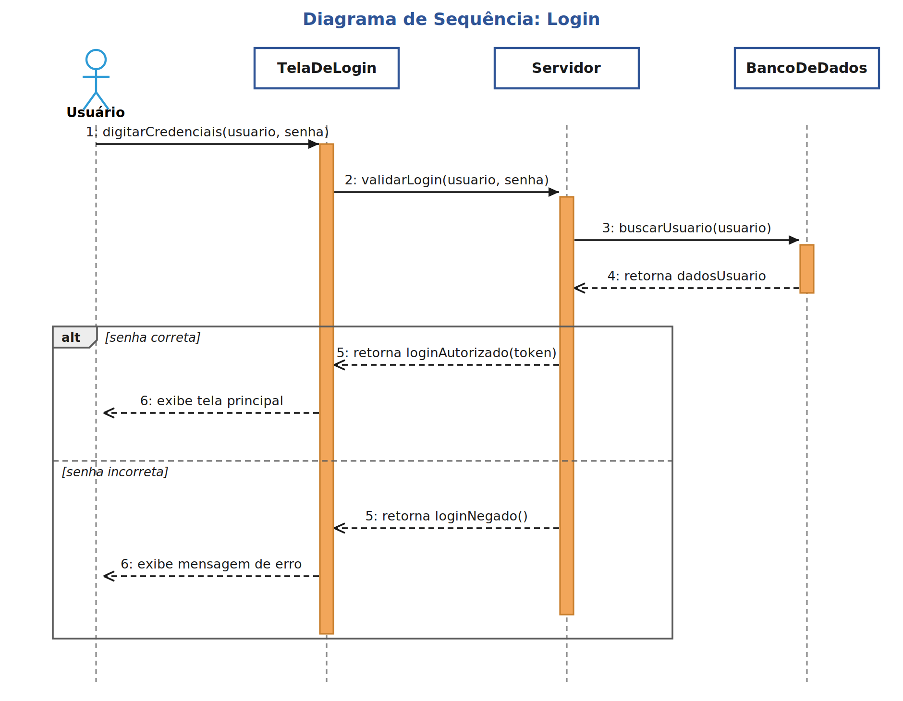
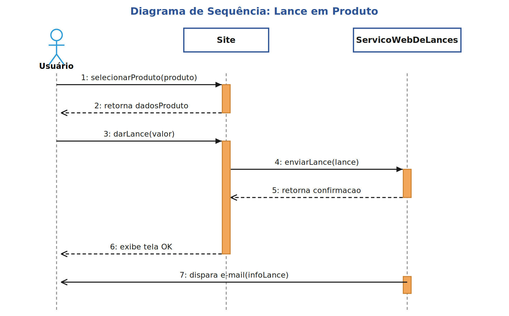

# Atividade: Diagrama de Sequência UML

**Aluna:** Thayná Batista da Silva

**Curso:** Tecnólogo em Análise e Desenvolvimento de Sistemas

**Unidade Curricular:** Engenharia de Software

**Professora:** Sônia Gomes

## Legenda de notação

| Elemento | Significado |
|---|---|
| Linha sólida com seta cheia | Mensagem síncrona |
| Linha tracejada com seta aberta | Mensagem de retorno |
| Linha sólida com seta aberta | Mensagem assíncrona |
| Retângulo laranja | Caixa de ativação |
| Retângulo `alt` | Fragmento de alternativa (if/else) |

## Atividade Prática 1: Processo de Login

**Participantes:** Usuário (Ator), TelaDeLogin, Servidor, BancoDeDados

**Cenário 1:** login bem-sucedido.
**Cenário 2:** login com falha (senha incorreta), tratado com o fragmento `alt`.

Fluxo:
1. Usuário digita usuário e senha na TelaDeLogin.
2. TelaDeLogin envia as credenciais ao Servidor para validação.
3. Servidor consulta o usuário no BancoDeDados.
4. BancoDeDados retorna os dados do usuário.
5. `alt` [senha correta]: Servidor retorna autorização e a TelaDeLogin exibe a tela principal.
   [senha incorreta]: Servidor nega o login e a TelaDeLogin exibe mensagem de erro.

## Atividade Prática 2: Lance em Produto

**Participantes:** Usuário (Ator), Site, ServicoWebDeLances

Fluxo:
1. Usuário seleciona um produto no Site.
2. Site retorna os dados do produto.
3. Usuário dá um lance no Site.
4. Site envia o lance para o ServicoWebDeLances.
5. ServicoWebDeLances confirma o recebimento ao Site.
6. Site exibe tela de confirmação (OK) ao usuário.
7. ServicoWebDeLances dispara e-mail assíncrono ao usuário com as informações do lance.

## Referências

- Creately. (2025). *Sequence Diagram Tutorial - Complete Guide with Examples*.
- Figma. (n.d.). *What is a sequence diagram?*.
- GeeksforGeeks. (n.d.). *Sequence Diagrams - Unified Modeling Language (UML)*.
- Lucidchart. (n.d.). *UML Sequence Diagram Tutorial*.
- Miro. (2025). *What is a UML Sequence Diagram? | Ultimate Guide*.

---

## 👩‍🎓 Identificação Acadêmica

| Campo | Descrição |
| :--- | :--- |
| **Unidade Curricular** | `[TADS25.109/3N]` Engenharia de Software — 2026.2 |
| **Professora** | Sonia Gomes de Oliveira |
| **Instituição** | Faculdade Senac de Pernambuco — Recife/PE |
| **Curso** | Análise e Desenvolvimento de Sistemas |
| **Turma** | 2025.32.109 — Noite |
| **Aluna** | Thayná Batista da Silva |

---

## 👩‍💻 Autora

### Thayná Batista da Silva

📧 thaynabdstec@gmail.com · 📱 +55 (81) 97912-6121

Estudante de **Análise e Desenvolvimento de Sistemas** — Faculdade Senac Recife · Previsão de formatura: 2027

 

---

Feito com 💜 por **Thayná Batista da Silva** para o **A Unidade Currícular Engenharia de Software da Faculdade Senac Recife-PE, Tecnólogo em Análise e Desenvolvimento de Sistemas, 2026.2, Professora Sonia Gomes de Oliveira**

**Copyright © 2026 — Todos os direitos reservados.**

