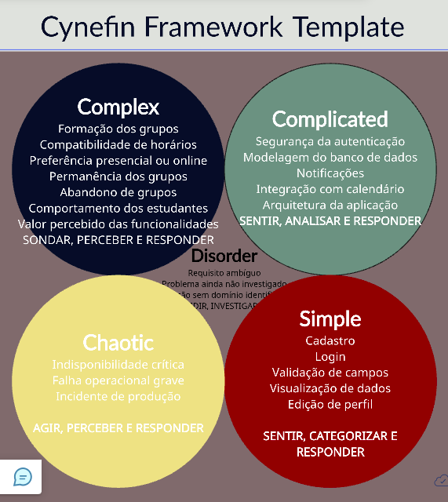

# Atividade Avaliativa Individual, Cynefin e Priorização de Backlog

## Engenharia de Software, 2026.2

| Informação | Dados |
|---|---|
| Unidade Curricular | TADS25.109/3N, Engenharia de Software |
| Professora | Sonia Gomes de Oliveira |
| Aluna | Thayná Batista da Silva |
| Curso | Análise e Desenvolvimento de Sistemas |
| Instituição | Faculdade Senac Pernambuco |
| Local | Recife, Pernambuco, Brasil |
| Perfil | Analista de Sistemas em formação |

## Sumário

1. [Apresentação](#1-apresentação)
2. [Projeto Modelo](#2-projeto-modelo)
3. [Problema](#3-problema)
4. [Objetivos](#4-objetivos)
5. [Premissas e Restrições](#5-premissas-e-restrições)
6. [Product Backlog](#6-product-backlog)
7. [Priorização MoSCoW](#7-priorização-moscow)
8. [Análise Cynefin](#8-análise-cynefin)
9. [Diagnóstico do Projeto](#9-diagnóstico-do-projeto)
10. [Estratégia de Execução](#10-estratégia-de-execução)
11. [Metodologia Escolhida](#11-metodologia-escolhida)
12. [Relação entre Cynefin, MoSCoW e Scrum](#12-relação-entre-cynefin-moscow-e-scrum)
13. [Diagrama Cynefin no Creately](#13-diagrama-cynefin-no-creately)
14. [MVP](#14-mvp)
15. [Riscos e Mitigações](#15-riscos-e-mitigações)
16. [Indicadores de Sucesso](#16-indicadores-de-sucesso)
17. [Conclusão](#17-conclusão)
18. [Referências](#18-referências)

---

# 1. Apresentação

Esta atividade aplica conceitos de Engenharia de Software para analisar, priorizar e organizar o desenvolvimento de um aplicativo mobile destinado a conectar alunos do SENAC para a formação de grupos de estudos presenciais e online.

A proposta considera uma característica relevante do contexto acadêmico: muitos estudantes conciliam trabalho e estudos. Dessa forma, os horários disponíveis podem ser conflitantes e encontros presenciais podem não ser viáveis para todos. A possibilidade de encontros online amplia as alternativas de participação, mas também exige comunicação, coordenação e disponibilidade compatível.

A atividade utiliza três instrumentos complementares:

* **Product Backlog**, para registrar os requisitos do produto.
* **MoSCoW**, para priorizar os requisitos.
* **Cynefin**, para classificar a natureza do contexto e orientar a tomada de decisão.

A partir do diagnóstico, a metodologia **Scrum** é selecionada para apoiar o desenvolvimento incremental e a adaptação contínua do produto.

# 2. Projeto Modelo

## Aplicativo mobile para formação de grupos de estudos entre alunos do SENAC

O produto proposto tem como finalidade facilitar a conexão entre estudantes interessados em estudar as mesmas disciplinas ou assuntos, considerando principalmente:

* interesses acadêmicos;
* disponibilidade de horários;
* modalidade presencial ou online;
* formação e participação em grupos;
* organização dos encontros;
* comunicação entre participantes.

O aplicativo deve reduzir a dificuldade de encontrar colegas com interesses e disponibilidade compatíveis.

# 3. Problema

Estudantes que trabalham e estudam podem ter pouco tempo disponível para atividades colaborativas.

Mesmo quando dois estudantes cursam a mesma disciplina, eles podem possuir horários incompatíveis. Também podem existir restrições relacionadas a deslocamento, trabalho, compromissos acadêmicos e preferências individuais.

### Problema central

> Como facilitar a formação e organização de grupos de estudos entre alunos do SENAC considerando diferentes interesses acadêmicos, disponibilidades de horário e possibilidades de encontros presenciais ou online?

O sistema deve facilitar a conexão entre estudantes, mas não pode garantir antecipadamente que todos os grupos funcionarão da mesma maneira. O comportamento real dos usuários precisa ser observado e utilizado para orientar a evolução do produto.

# 4. Objetivos

## 4.1 Objetivo geral

Desenvolver uma solução mobile que facilite a formação e a organização de grupos de estudos entre alunos do SENAC, considerando interesses acadêmicos e disponibilidade de horários.

## 4.2 Objetivos específicos

1. Permitir cadastro e autenticação dos estudantes.
2. Permitir configuração do perfil acadêmico.
3. Permitir cadastro de disciplinas e interesses.
4. Permitir cadastro e atualização de disponibilidade.
5. Identificar estudantes com interesses e horários compatíveis.
6. Permitir criação de grupos de estudos.
7. Permitir participação em grupos existentes.
8. Permitir escolha entre encontros presenciais e online.
9. Permitir agendamento de encontros.
10. Facilitar a comunicação entre participantes.
11. Enviar notificações relacionadas aos grupos e encontros.
12. Coletar feedback para orientar futuras evoluções.

# 5. Premissas e Restrições

## 5.1 Premissas

* O público principal é composto por estudantes do SENAC.
* O produto será utilizado em dispositivos móveis.
* Parte dos estudantes concilia trabalho e estudos.
* A disponibilidade pode mudar ao longo do tempo.
* Os grupos podem funcionar presencialmente ou online.
* Os estudantes possuem diferentes disciplinas e interesses.
* O comportamento dos usuários somente poderá ser validado com utilização real.
* O backlog deverá permanecer revisável.

## 5.2 Restrições

* Horários de trabalho e estudo podem conflitar.
* Deslocamento pode dificultar encontros presenciais.
* A adesão inicial pode ser insuficiente para formar grupos.
* Recursos de recomendação avançada dependem de dados.
* O MVP deve priorizar a resolução do problema principal.

# 6. Product Backlog

| ID | História de Usuário | MoSCoW | Valor | Justificativa |
|---|---|---|---|---|
| US01 | Como estudante, quero criar uma conta para acessar o aplicativo. | Must Have | Alto | Requisito básico de acesso. |
| US02 | Como estudante, quero realizar login para acessar minha conta com segurança. | Must Have | Alto | Necessário para autenticação. |
| US03 | Como estudante, quero informar meu curso e disciplinas de interesse para encontrar pessoas com objetivos semelhantes. | Must Have | Muito alto | Fundamenta a compatibilidade acadêmica. |
| US04 | Como estudante, quero informar meus horários disponíveis para encontrar grupos compatíveis. | Must Have | Muito alto | Resolve diretamente o problema dos horários conflitantes. |
| US05 | Como estudante, quero visualizar estudantes com interesses e horários compatíveis. | Must Have | Muito alto | Permite encontrar potenciais integrantes. |
| US06 | Como estudante, quero criar um grupo de estudos. | Must Have | Muito alto | Função central do produto. |
| US07 | Como estudante, quero participar de um grupo existente. | Must Have | Muito alto | Permite aderir a grupos existentes. |
| US08 | Como estudante, quero escolher entre encontro presencial ou online. | Must Have | Muito alto | Atende diferentes restrições. |
| US09 | Como estudante, quero definir data e horário para um encontro. | Must Have | Muito alto | Necessário para organização. |
| US10 | Como integrante, quero visualizar os encontros agendados do grupo. | Should Have | Alto | Melhora a organização. |
| US11 | Como integrante, quero receber notificações sobre encontros e alterações. | Should Have | Alto | Reduz perda de informações. |
| US12 | Como integrante, quero conversar com os participantes do grupo. | Should Have | Alto | Facilita coordenação. |
| US13 | Como estudante, quero editar minha disponibilidade quando meus horários mudarem. | Should Have | Alto | A rotina é variável. |
| US14 | Como estudante, quero editar meus interesses acadêmicos. | Should Have | Médio alto | Mantém os dados atualizados. |
| US15 | Como integrante, quero cancelar minha participação em um encontro. | Could Have | Médio | Útil, mas não essencial. |
| US16 | Como estudante, quero receber sugestões automáticas de grupos compatíveis. | Could Have | Médio | Agrega valor após validação. |
| US17 | Como estudante, quero avaliar a experiência com um grupo. | Could Have | Médio | Gera feedback. |
| US18 | Como estudante, quero visualizar meu histórico de grupos e encontros. | Could Have | Baixo | Recurso complementar. |
| US19 | Como estudante, quero integrar os encontros ao calendário do dispositivo. | Could Have | Baixo | Facilita a agenda. |
| US20 | Como estudante, quero receber recomendações inteligentes de horários. | Won't Have agora | Baixo | Depende de dados e validação. |
| US21 | Como estudante, quero receber recomendações baseadas no meu comportamento histórico. | Won't Have agora | Baixo | Exige dados históricos e maturidade. |

O backlog também está disponível em [`backlog.csv`](./backlog.csv).

# 7. Priorização MoSCoW

## Must Have

Requisitos indispensáveis para que o produto cumpra sua finalidade principal:

* Cadastro.
* Login.
* Perfil acadêmico.
* Disciplinas e interesses.
* Disponibilidade.
* Identificação de compatibilidade.
* Criação de grupos.
* Participação em grupos.
* Modalidade presencial ou online.
* Agendamento de encontros.

## Should Have

* Visualização de encontros.
* Notificações.
* Comunicação.
* Atualização da disponibilidade.
* Atualização dos interesses.

## Could Have

* Cancelamento de participação.
* Sugestões automáticas.
* Avaliação.
* Histórico.
* Integração com calendário.

## Won't Have agora

* Recomendação inteligente de horários.
* Recomendação baseada em comportamento histórico.

A categoria Won't Have agora não significa que esses recursos nunca serão desenvolvidos. Significa que não são prioridade para a primeira versão.

# 8. Análise Cynefin

O Framework Cynefin é utilizado para compreender a natureza de uma situação e selecionar uma estratégia de decisão adequada.

Para esta atividade, foram considerados os domínios Claro, Complicado, Complexo, Caótico e Desordem.

## 8.1 Claro

A relação entre causa e efeito é evidente e existem procedimentos conhecidos.

**Aplicação:** cadastro, login, validação de campos, visualização de dados e edição básica de perfil.

**Estratégia:** Sentir, categorizar e responder.

## 8.2 Complicado

Existe relação entre causa e efeito, porém é necessário conhecimento especializado e análise.

**Aplicação:** segurança da autenticação, modelagem do banco de dados, notificações, integração com calendário e arquitetura da aplicação.

**Estratégia:** Sentir, analisar e responder.

## 8.3 Complexo

Os resultados dependem de interações e padrões que emergem com o tempo. A relação entre causa e efeito é compreendida principalmente após a experimentação.

**Aplicação:** formação dos grupos, compatibilidade de horários, preferência entre presencial e online, permanência dos grupos, abandono, comportamento dos estudantes, valor percebido e aceitação das funcionalidades.

**Estratégia:** Sondar, perceber e responder.

**Este é o domínio predominante do projeto.**

## 8.4 Caótico

Existe instabilidade suficiente para exigir uma ação imediata antes de uma análise mais estruturada.

**Aplicação:** indisponibilidade crítica, falha operacional grave e incidente de produção.

**Estratégia:** Agir, perceber e responder.

## 8.5 Desordem

Representa uma situação em que ainda não existe entendimento suficiente para classificar corretamente o contexto.

**Aplicação:** requisito ambíguo, problema ainda não investigado e situação nova sem evidências suficientes.

**Estratégia:** Dividir o problema, investigar e classificar.

# 9. Diagnóstico do Projeto

## Classificação: COMPLEXO

O projeto é predominantemente **Complexo**.

A complexidade principal não decorre apenas da tecnologia. O fator determinante é o comportamento dos usuários.

Não é possível garantir antecipadamente:

* quais horários terão maior adesão;
* se os estudantes preferirão encontros presenciais ou online;
* quais critérios formarão grupos mais efetivos;
* se os grupos permanecerão ativos;
* quais fatores causarão abandono;
* quais funcionalidades serão consideradas mais úteis.

Essas respostas precisam ser obtidas por experimentação e observação.

Por isso, a abordagem adequada é incremental, empírica e adaptativa.

# 10. Estratégia de Execução

A estratégia principal é **Sondar, perceber e responder**.

### Sondar

Realizar pequenos experimentos, como testar compatibilidade por disciplina, horário e modalidade.

### Perceber

Observar grupos criados, grupos ativos, encontros realizados, participação, abandono, horários, modalidade e feedback.

### Responder

Utilizar os resultados para ajustar o produto e atualizar o Product Backlog.

O objetivo é aprender com o uso real, não tentar prever todo o comportamento antes do lançamento.

# 11. Metodologia Escolhida

## Scrum

Entre Cascata, Scrum e Kanban, a metodologia escolhida é **Scrum**.

A escolha se justifica porque o projeto apresenta:

* requisitos sujeitos a mudanças;
* incerteza sobre o comportamento dos usuários;
* necessidade de experimentação;
* necessidade de feedback;
* necessidade de entregas incrementais;
* necessidade de revisão do Product Backlog.

### Por que não Cascata?

A abordagem em Cascata pressupõe maior estabilidade e previsibilidade dos requisitos. Neste projeto, decisões importantes dependem de evidências obtidas durante o desenvolvimento e utilização.

### Por que não Kanban?

Kanban é útil para visualizar e controlar fluxo de trabalho, mas o Scrum oferece uma estrutura adequada para ciclos incrementais de desenvolvimento, inspeção e adaptação.

# 12. Relação entre Cynefin, MoSCoW e Scrum

| Instrumento | Pergunta respondida | Aplicação |
|---|---|---|
| Cynefin | Que tipo de contexto estamos enfrentando? | Identifica o projeto como predominantemente Complexo. |
| MoSCoW | O que deve ser priorizado? | Classifica os requisitos. |
| Scrum | Como organizar o desenvolvimento? | Estrutura ciclos incrementais e feedback. |

```text
CONTEXTO DO PROJETO
        |
        v
     CYNEFIN
        |
        v
COMPLEXO, PREDOMINANTE
        |
        v
     MoSCoW
        |
        v
BACKLOG PRIORIZADO
        |
        v
      SCRUM
        |
        v
DESENVOLVIMENTO INCREMENTAL
        |
        v
VALIDAÇÃO E FEEDBACK
        |
        v
ATUALIZAÇÃO DO BACKLOG
        |
        +------> NOVO CICLO
```

# 13. Diagrama Cynefin no Creately

O diagrama específico desta atividade foi produzido no **Creately**.

## Arquivo

`cynefin-diagram-creately.png`

## Visualização



## Arquivo publicado

[cynefin-diagram-creately.png no GitHub](https://github.com/thaynabds/SENAC-Engenharia-de-Software---2026.2/blob/90e5a8df03387aa8c0199c8db80aca7f297b6e97/cynefin-diagram-creately.png)

O diagrama apresenta os cinco contextos do Framework Cynefin aplicados ao projeto. O domínio Complexo recebe destaque porque representa o principal desafio do produto: a formação e manutenção de grupos depende das interações entre estudantes, seus horários, interesses, preferências e comportamento.

### Conteúdo dos domínios

**Claro:** cadastro, login, validações, visualização e edição básica.

**Complicado:** segurança, banco de dados, notificações, calendário e arquitetura.

**Complexo:** formação dos grupos, compatibilidade de horários, presencial ou online, permanência, abandono e comportamento dos estudantes.

**Caótico:** indisponibilidade crítica, falha operacional grave e incidentes de produção.

**Desordem:** requisitos ambíguos e problemas ainda não investigados.

# 14. MVP

## Incluído

* Cadastro.
* Login.
* Perfil acadêmico.
* Disciplinas e interesses.
* Disponibilidade.
* Compatibilidade.
* Criação de grupo.
* Participação em grupo.
* Modalidade presencial ou online.
* Agendamento.

## Não incluído inicialmente

* Recomendação inteligente de horários.
* Recomendação baseada em histórico.
* Recursos avançados de inteligência.
* Integrações avançadas com calendários.

# 15. Riscos e Mitigações

| Risco | Impacto | Mitigação |
|---|---|---|
| Baixa adesão | Poucos estudantes disponíveis | Realizar piloto e divulgação acadêmica. |
| Horários conflitantes | Dificuldade de formação | Utilizar disponibilidade como critério central. |
| Abandono de grupos | Perda de continuidade | Permitir atualização e acompanhar indicadores. |
| Excesso de funcionalidades | Atraso do MVP | Aplicar MoSCoW. |
| Comunicação assíncrona | Perda de informações | Utilizar notificações e histórico. |
| Dados insuficientes | Recomendações pouco confiáveis | Adiar recursos inteligentes. |
| Mudança de requisitos | Retrabalho | Manter backlog revisável. |

# 16. Indicadores de Sucesso

| Indicador | Objetivo |
|---|---|
| Grupos criados | Medir formação de grupos. |
| Grupos ativos | Medir continuidade. |
| Encontros realizados | Medir utilização efetiva. |
| Participantes por grupo | Avaliar formação. |
| Taxa de abandono | Identificar problemas de permanência. |
| Horários mais utilizados | Identificar padrões de disponibilidade. |
| Presencial x online | Identificar preferência de modalidade. |
| Avaliação dos usuários | Medir percepção de valor. |

Os indicadores devem alimentar a evolução do Product Backlog.

# 17. Conclusão

A análise demonstra que o aplicativo para formação de grupos de estudos entre alunos do SENAC possui características predominantemente **Complexas**.

A principal fonte de incerteza está no comportamento dos estudantes e nas interações necessárias para formar e manter grupos. A disponibilidade de horários, a preferência entre encontros presenciais e online, a permanência dos participantes e a percepção de valor somente poderão ser avaliadas adequadamente por meio da utilização e experimentação.

O **MoSCoW** permite concentrar o desenvolvimento nas funcionalidades indispensáveis para o MVP.

O **Cynefin** permite compreender que o problema central exige experimentação, observação e adaptação.

O **Scrum** fornece uma abordagem adequada para desenvolver o produto em incrementos e incorporar o feedback obtido em novos ciclos.

Portanto:

> **Cynefin identifica o contexto, MoSCoW define a prioridade e Scrum organiza a execução.**

# 18. Referências

* Creately. **Cynefin Framework Template**. https://creately.com/usage/cynefin-framework-template/
* Creately. **Cynefin Framework Guide**. https://creately.com/guides/understanding-the-cynefin-framework/
* Cynefin.io. **Cynefin Domains**. https://cynefin.io/wiki/Cynefin_Domains
* Scrum.org. **Understanding Complexity**. https://www.scrum.org/resources/blog/understanding-complexity
* Mermaid. **Cynefin Diagram Syntax**. https://mermaid.js.org/syntax/cynefin.html

## 👩‍💻 Autora

<div align="center">

### Thayná Batista da Silva

<a href="https://br.linkedin.com/in/thaynabds" target="_blank">
  
</a>
<a href="https://www.instagram.com/thaynabdstec/" target="_blank">
  
</a>
<a href="mailto:thaynabdstec@gmail.com">
  
</a>

📧 thaynabdstec@gmail.com · 📱 +55 (81) 97912-6121

Estudante de **Análise e Desenvolvimento de Sistemas** — Faculdade Senac Recife · Previsão de formatura: 2027

<br/>


</div>

---

<div align="center">

Feito com 💜 por **Thayná Batista da Silva** para o **A Unidade Currícular Engenharia de Software da Faculdade Senac Recife-PE, Tecnólogo em Análise e Desenvolvimento de Sistemas, 2026.2, Professora Sonia Gomes de Oliveira**

**Copyright © 2026 — Todos os direitos reservados.**

</div>
